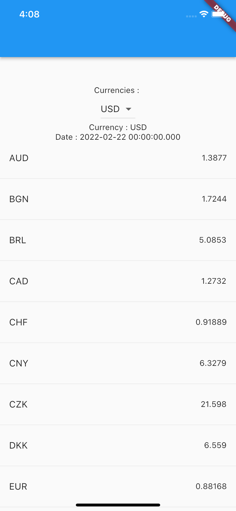

# Flutter - Simple Currency App

A simple currency app I made to learn the dio package.

API I use : https://www.frankfurter.app/docs/

## Run Locally

Clone the project

```bash
  git clone https://github.com/yagizdo/currency_app
```

Go to the project directory

```bash
  cd flutter-currency-app-master
```

Install dependencies

```bash
  flutter pub get
```

Run App

```bash
  flutter run
```


##  Libraries I use in the application:
- Dio : https://pub.dev/packages/dio

## Screenshots



## Contributing

Contributions are always welcome!
